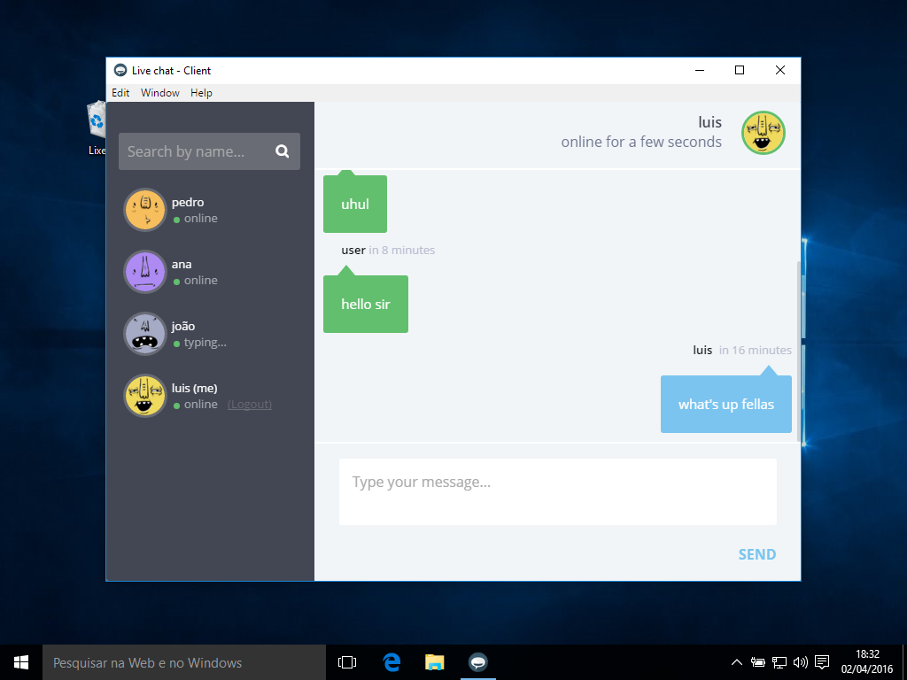

# sample-chat-electron
Socket.io based chat server and clients, implemented in NodeJS for the Distributed Systems Course (MC714 1s2016), [Prof. Leandro Villas](http://wwww.ic.unicamp.br/~leandro) in the [Institute of Computing, UNICAMP](http://ic.unicamp.br/en). Inspired in the [Example Chat Application](http://chat.socket.io) from the [Socket.io Official Documentation](http://socket.io/get-started/chat/).

See the [blog post](https://luiseduardobrito.me/blog/creating-electron-chat-using-socket-io) about the project for the step-by-step guide.

**Disclaimer:** This project has no active maintenance, any help is very welcome.

**Features**:
- Fully features single room chat application, based on a master Server and several slave Clients.
- Online/offline and Typing real time updates
- Multiple users in multiple windows easier testing

**Core Technologies**:
- [Server](https://github.com/luiseduardobrito/sample-chat-electron/tree/master/server): NodeJS, Express and Socket.io
- [Client](https://github.com/luiseduardobrito/sample-chat-electron/tree/master/client): Electron, Socket.io and AngularJS
- [Landing](https://github.com/luiseduardobrito/sample-chat-electron/tree/master/landing): NodeJS, Bootstrap and jQuery

**Chat Specs**:
- Real-time bidirectional event-based communication based on [Socket.io](https://github.com/socketio/socket.io)
- WebSockets implementation backed by [Engine.io](https://github.com/socketio/engine.io)
- Fallbacks to: ```flashsocket```, ```htmlfile```,  ```xhr-polling```, ```jsonp-polling```

Checkout the [Sample Chat Server (hosted in Heroku)](https://radiant-river-70847.herokuapp.com/api).

#### Screenshots
Sample binaries running on Mac OSX and Windows 10:





### Download Sample Binaries
You can test the chat application using the precompiled binaries. They all point to the [Sample Server hosted in Heroku](https://radiant-river-70847.herokuapp.com/api). To connect to your own server instance you'll need to build from the source. It's in the roadmap a simple command line script to make all the hard work for you.

- [Package for OSX (.dmg)](https://github.com/luiseduardobrito/sample-chat-electron/blob/master/build/SampleChat.dmg?raw=true)
- [Compressed files for Windows (.zip)](https://github.com/luiseduardobrito/sample-chat-electron/blob/master/build/SampleChat.zip?raw=true)


### Documentation
The full JSDoc Specification is planned in the [Roadmap](#roadmap). For more technical details, refer to the [Technical Specification](./docs/technical-specs.md).


### Open Source Dependencies

This project was only possible because the work of thousands of independent developers and organizations. The full dependencies are listed in the [package.json](https://github.com/luiseduardobrito/sample-chat-electron/blob/master/package.json) and [bower.json](https://github.com/luiseduardobrito/sample-chat-electron/blob/master/bower.json) files, but I want to specially thank:


Desktop app client UI by David ([@retyui](https://twitter.com/retyui))

- [Scripts hosted on Codepen](http://codepen.io/retyui/pen/zxGqPJ)

Adorable Avatars by Adorable.io ([@adorableio](https://twitter.com/adorableio))

- [Homepage](http://avatars.adorable.io/)
- [Repository on GitHub](https://github.com/adorableio/adorable-avatars)
- [License (MIT)](https://raw.githubusercontent.com/adorableio/adorable-avatars/master/LICENSE)

Start Bootstrap Landing Page by [Blackrock Digital](http://blackrockdigital.io/)

- [Homepage](http://startbootstrap.com/template-overviews/landing-page/)
- [Repository on GitHub](https://github.com/BlackrockDigital/startbootstrap-landing-page)
- [License (MIT)](https://github.com/BlackrockDigital/startbootstrap/blob/gh-pages/LICENSE)

App Icon: Hipchat / Flat OSX Icons by drslash

- [Repository on GitHub](https://github.com/dr-slash/icons-flat-osx)
- [License (CC BY-NC 4.0)](https://github.com/dr-slash/icons-flat-osx/blob/master/LICENSE.md)


### Author
- Luis Eduardo Brito (RA138760) <[luis.brito@students.ic.unicamp.br](mailto:luis.brito@students.ic.unicamp.br)>


### License
This project is fully open in the terms of the  MIT License. For further information, checkout de [full license text](./LICENSE).
